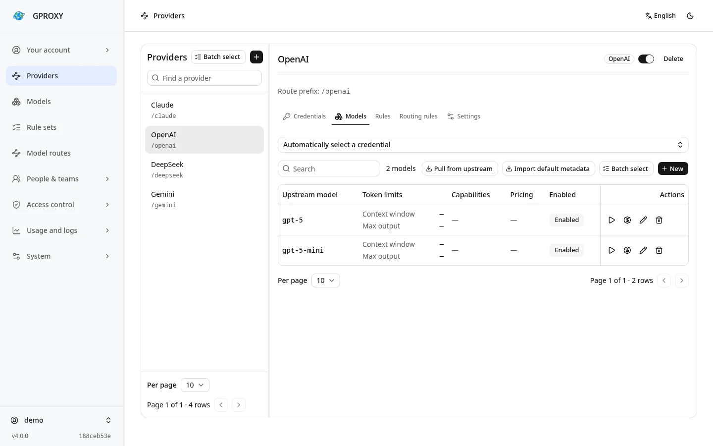
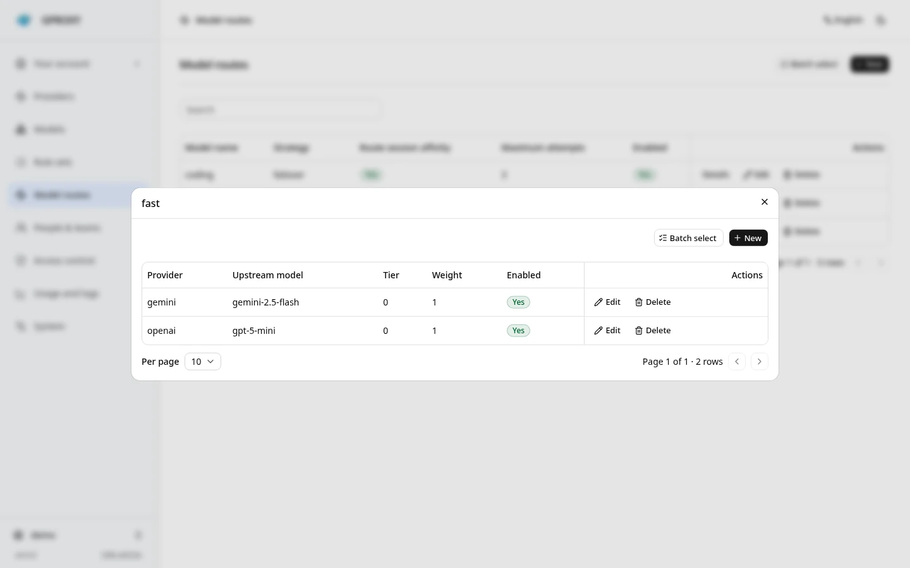
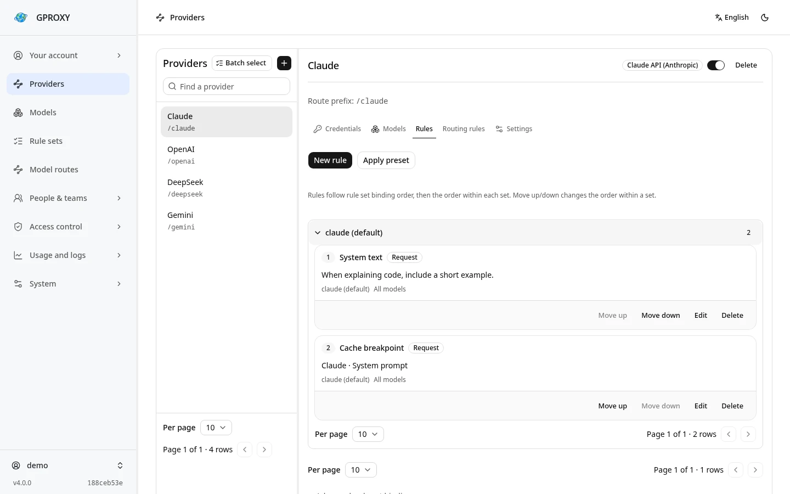

<div align="center">

# GPROXY

**One API endpoint for your LLM services.**

[English](README.md) · [简体中文](README.zh-CN.md)

[](https://github.com/LeenHawk/gproxy/releases/latest)
[](https://github.com/LeenHawk/gproxy/actions/workflows/ci.yml)
[](LICENSE)
[](https://github.com/LeenHawk/gproxy/stargazers)

[Documentation](https://gproxy.leenhawk.com/) · [Downloads](https://github.com/LeenHawk/gproxy/releases) · [Discussions](https://github.com/LeenHawk/gproxy/discussions) · [Sponsor](https://github.com/sponsors/LeenHawk)

[](https://gproxy.leenhawk.com/)

[](https://deploy.workers.cloudflare.com/?url=https://github.com/LeenHawk/gproxy/tree/dev/deploy/cloudflare-button)

</div>

GPROXY is a self-hosted LLM API gateway written in Rust. Add your upstream accounts, configure model routes in the console, and call different services through the same endpoint and gateway API key. Provider changes, credential updates, usage, and costs are managed in one place.

v4 runs as a desktop or mobile application with a setup wizard, a CLI service, a container, or a Cloudflare Worker. Use the [latest stable release](https://github.com/LeenHawk/gproxy/releases/latest) for regular deployments; development snapshots are available under [nightly](https://github.com/LeenHawk/gproxy/releases/tag/nightly).

## Features

<table>
<tr>
<td width="50%" valign="top">
<h3>Protocols and clients</h3>
<p>Accepts OpenAI Chat Completions, Responses, Claude Messages, and Gemini GenerateContent, with protocol conversion and streaming. Client guides cover Codex CLI, Claude Code, and other tools.</p>
</td>
<td width="50%" valign="top">
<h3>Credential pools</h3>
<p>Use API keys, OAuth, or Cookies as supported by each channel. Manage refresh, health, and quotas, with configurable failover to other credentials or providers.</p>
</td>
</tr>
<tr>
<td valign="top">
<h3>Model routes</h3>
<p>Give clients a fixed model name such as <code>fast</code>. Change its providers, upstream models, weights, and fallback tiers in the gateway without editing each client.</p>
</td>
<td valign="top">
<h3>Request rewrites</h3>
<p>Configure system text, cache breakpoints, JSON edits, regular expressions, and header rules for each provider to accommodate different clients.</p>
</td>
</tr>
<tr>
<td valign="top">
<h3>Access, usage, and costs</h3>
<p>Manage users, organizations, teams, API keys, permissions, and spending budgets. Inspect usage, upstream and downstream request logs, and audit records in the console.</p>
</td>
<td valign="top">
<h3>Local and server deployments</h3>
<p>Use the application on a personal device, run the CLI or container on a server, or deploy to Cloudflare Workers. Rust projects can embed the gateway through its SDK.</p>
</td>
</tr>
</table>

Built-in channels include OpenAI, Claude API / Code / Web, Codex, Gemini CLI, Google AI Studio, Copilot, DeepSeek, Kimi, OpenRouter, AWS Bedrock, Azure, Vertex, and xAI. Other services that speak OpenAI, Claude, or Gemini protocols can use the `custom` channel.

Support for images, audio, files, WebSocket / Realtime, and other operations depends on the channel and upstream. See [Providers and credentials](https://gproxy.leenhawk.com/guides/providers/) and the [client guides](https://gproxy.leenhawk.com/guides/cli-clients/).

## Console preview

Screenshots of the v4 console, using a separate demo instance with example data.

**Providers and models** — Manage upstream accounts and model catalogs in one place.



<details>
<summary>View model routes and request rules</summary>

**Model routes** — Configure providers, weights, and fallback tiers for a fixed model name.



**Request rules** — Configure system text and cache breakpoints for a provider.



</details>

## Quick start

### On a computer or phone

1. Download **Application** (`gproxy-tauri-*`) for your platform from [Releases](https://github.com/LeenHawk/gproxy/releases/latest).
2. Open it and follow the wizard to configure the instance, administrator account, and optional configuration import.
3. Save the service URL and gateway API key. Open the console and add a provider and upstream credential.
4. Test the credential, create a model route named `fast`, and add the working model as a member.

Application uses its in-app console; its HTTP port serves gateway API calls.

### On a server

Download **CLI** (`gproxy-*`), extract it, and run:

```sh
chmod +x ./gproxy
./gproxy serve --data-dir ./data --port 8787
```

On Windows, use `gproxy.exe`. Save the administrator password and API key printed on first startup, then open **http://127.0.0.1:8787/console/**. Add a provider, test its credential, and create a model route as above.

The CLI listens on localhost by default, with SQLite at `./data/gproxy.db`. Configure and save `GPROXY_MASTER_KEY` before adding credentials; without it, upstream secrets are stored unencrypted. Keep the data directory and master key when updating. Configure the listening address and HTTPS for remote access. See the [configuration reference](https://gproxy.leenhawk.com/reference/configuration/).

### Send a request

Replace the key below with your gateway API key. `fast` is the route created above:

```sh
export GPROXY_KEY='your-gproxy-api-key'
curl -sS http://127.0.0.1:8787/v1/chat/completions \
  -H "Authorization: Bearer $GPROXY_KEY" \
  -H 'Content-Type: application/json' \
  -d '{"model":"fast","messages":[{"role":"user","content":"Hello"}],"stream":true}'
```

### Deploy to Cloudflare

[](https://deploy.workers.cloudflare.com/?url=https://github.com/LeenHawk/gproxy/tree/dev/deploy/cloudflare-button)

The template deploys the official prebuilt **v4.0.1** bundle without compiling Rust. Follow the form to create D1 and set the administrator password and master key, then open `/console/`. See the [Cloudflare deployment guide](https://gproxy.leenhawk.com/deployment/edge/) for details.

### Other deployment options

| Option | Use case | Guide |
| --- | --- | --- |
| Application | Desktop or mobile, managed in the app | [Platform installation](https://gproxy.leenhawk.com/getting-started/installation/) |
| CLI / container | Persistent server with a browser console | [Installation and containers](https://gproxy.leenhawk.com/getting-started/installation/) |
| Cloudflare Workers | Edge deployment | [Workers deployment](https://gproxy.leenhawk.com/deployment/edge/) |
| Rust SDK | Embed in your own program | [gproxy-sdk](crates/gproxy-sdk/README.md) |

Windows MSIX files are unsigned Store submission packages; use ZIP for a regular installation. macOS apps are not notarized. The HarmonyOS HAP is experimental and requires your own signature. See the installation guide for platform requirements.

## Performance

Configuration is loaded into in-memory snapshots, and outbound clients are reused by connection configuration. Log capture can be switched off, with separate settings for body logging.

These measurements use the official **[v4.0.0 Linux x86_64 release](https://github.com/LeenHawk/gproxy/releases/tag/v4.0.0)** on a Ryzen 7 8745H (8 cores, 16 threads) with SQLite on NVMe. The load generator, gateway, and mock upstream share one machine. Non-streaming Chat Completions requests go through authentication, model routing, usage extraction, pricing, and persistence. The mock reports 25 input tokens and 18 output tokens with no artificial delay.

Each round warms up each logging configuration for 2 seconds, then measures each connection count for 10 seconds with `oha 1.16.0`. There are three rounds. Each metric below is the median of those three runs. Body logging is off; usage recording and cost settlement are enabled in both logging configurations.

| Request logs | Connections | Requests/s | p50 | p99 |
| --- | ---: | ---: | ---: | ---: |
| Off | 1 | 2,882 | 0.34 ms | 0.50 ms |
| Off | 32 | 28,303 | 0.76 ms | 2.71 ms |
| Off | 64 | 27,263 | 1.47 ms | 41.91 ms |
| Upstream and downstream metadata | 64 | 7,765 | 2.81 ms | 45.16 ms |

With one connection, the gateway adds about **0.30 ms** to median latency compared with calling the mock directly. All **1,989,395** measured requests returned HTTP 200. After writes completed, persisted usage counts matched request counts, and every row passed token and cost checks. Input and output were each priced at $1 per million tokens, producing a recorded cost of $0.000043 per request.

At 64 connections, throughput stops increasing and p99 rises to about 42 ms, or 45 ms with metadata logging. This test covers short responses, same-protocol forwarding, and local SQLite. Long streams, protocol conversion, remote databases, and real upstreams need measurements with the intended workload.

## Upgrade from v3

Stop v3, back up the database, master key, and startup configuration, then start v4 with the same configuration. Supported v3 SQLite, PostgreSQL, MySQL, and D1 databases migrate automatically, preserving accounts, passwords, API keys, and historical usage. The migration report lists configuration that could not be mapped. Do not run v3 and v4 against the same database at once.

See [Migrating v3 to v4](https://gproxy.leenhawk.com/deployment/v3-to-v4/) for migration scope, backups, and failure handling.

## Development

Native builds require stable Rust, Go, and Clang. The console and docs require Node.js 22.12+ (24 LTS recommended) and pnpm. Linux desktop builds also require the WebKitGTK 4.1, GTK 3, and libsoup 3 development packages.

```sh
pnpm --dir console install --frozen-lockfile
pnpm --dir console build
cargo run -p gproxy -- serve
```

The console build synchronizes embedded assets. A fresh checkout built with only `cargo build` has no console bundle.

```sh
cargo fmt --all --check
cargo clippy --all-targets -- -D warnings
cargo test
pnpm --dir console lint
pnpm --dir console test
pnpm --dir docs install --frozen-lockfile
pnpm --dir docs check
pnpm --dir docs build
```

See [Building from source](https://gproxy.leenhawk.com/deployment/release-build/) for desktop and WASM checks, [Architecture](https://gproxy.leenhawk.com/introduction/architecture/) for the workspace layout, and [Adding a channel](https://gproxy.leenhawk.com/guides/adding-a-channel/) for extensions.

Report bugs through [Issues](https://github.com/LeenHawk/gproxy/issues). Report vulnerabilities privately through [Security](https://github.com/LeenHawk/gproxy/security).

## License

The gateway application is **AGPL-3.0-or-later**; see [LICENSE](LICENSE). `gproxy-protocol`, `gproxy-protocol-macros`, `gproxy-client`, `gproxy-cache`, `gproxy-file`, `gproxy-seaorm`, and `gproxy-tokenizer` are **MIT**, with a license in each directory.

## Star History

[](https://www.star-history.com/#LeenHawk/gproxy&Date)
