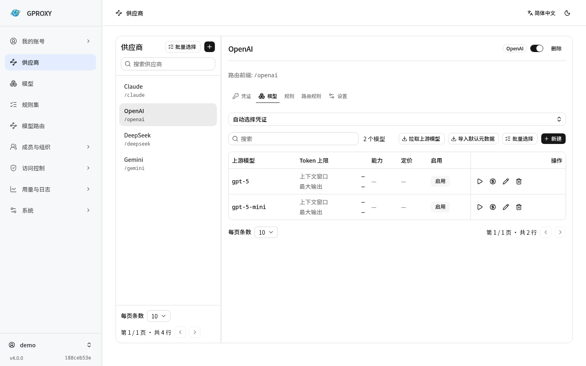
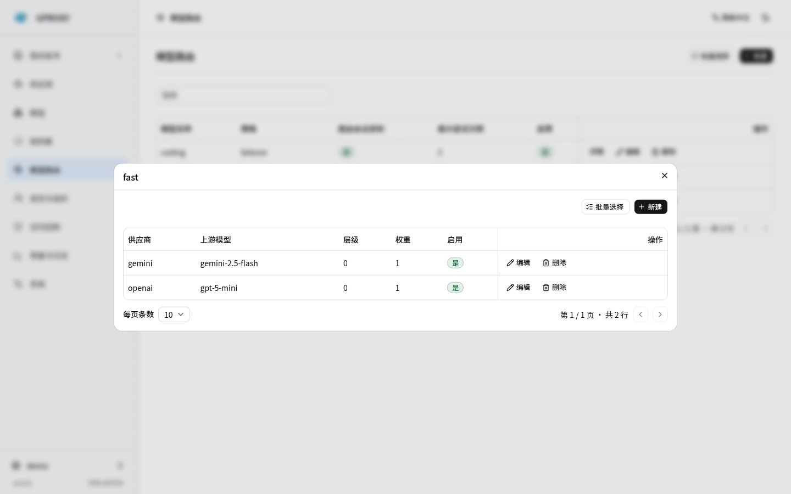
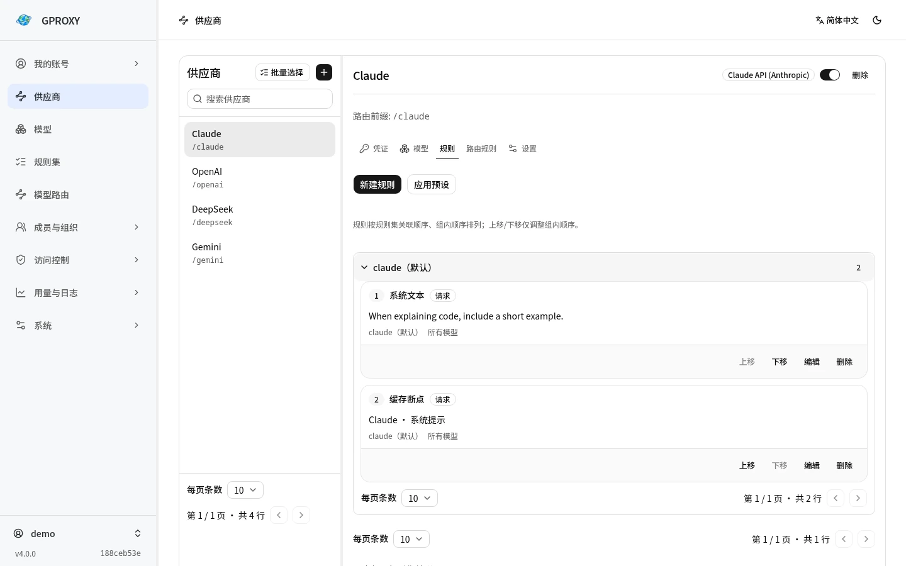

<div align="center">

# GPROXY

**把不同的大模型服务接到同一个 API 入口。**

[English](README.md) · [简体中文](README.zh-CN.md)

[](https://github.com/LeenHawk/gproxy/releases/latest)
[](https://github.com/LeenHawk/gproxy/actions/workflows/ci.yml)
[](LICENSE)
[](https://github.com/LeenHawk/gproxy/stargazers)

[文档](https://gproxy.leenhawk.com/zh-cn/) · [下载](https://github.com/LeenHawk/gproxy/releases) · [讨论](https://github.com/LeenHawk/gproxy/discussions) · [赞助](https://github.com/sponsors/LeenHawk)

[](https://gproxy.leenhawk.com/zh-cn/)

[](https://deploy.workers.cloudflare.com/?url=https://github.com/LeenHawk/gproxy/tree/dev/deploy/cloudflare-button)

</div>

GPROXY 是用 Rust 编写、可自行部署的 LLM API 网关。把上游账户接进来，在控制台配置模型路由，客户端就可以用同一组地址和网关 API Key 调用不同服务。切换供应商、更新凭证、查看用量和费用，都在网关里完成。

v4 提供带设置向导的桌面与移动应用，也可以作为命令行服务、容器或 Cloudflare Worker 运行。正式使用下载[最新稳定版](https://github.com/LeenHawk/gproxy/releases/latest)；开发快照见 [nightly](https://github.com/LeenHawk/gproxy/releases/tag/nightly)。

## 能做什么

<table>
<tr>
<td width="50%" valign="top">
<h3>协议与客户端</h3>
<p>接受 OpenAI Chat Completions、Responses、Claude Messages 和 Gemini GenerateContent，支持协议转换和流式响应。Codex CLI、Claude Code 等客户端可按指南接入。</p>
</td>
<td width="50%" valign="top">
<h3>上游账户池</h3>
<p>按渠道使用 API Key、OAuth 或 Cookie。集中管理凭证刷新、健康状态和额度；凭证失效或上游限流时，按配置尝试其他凭证或供应商。</p>
</td>
</tr>
<tr>
<td valign="top">
<h3>模型路由</h3>
<p>给客户端一个固定模型名，例如 <code>fast</code>。在网关中调整对应的供应商、上游模型、权重和回退层级，无需逐个修改客户端。</p>
</td>
<td valign="top">
<h3>请求改写</h3>
<p>为供应商配置系统提示词、缓存断点、JSON 改写、正则替换和请求头规则，在接入不同客户端时调整请求格式。</p>
</td>
</tr>
<tr>
<td valign="top">
<h3>权限、用量与费用</h3>
<p>管理用户、组织、团队和 API Key，设置访问权限与费用预算。控制台可查看用量、上下游请求日志和审计记录。</p>
</td>
<td valign="top">
<h3>本地或服务器部署</h3>
<p>个人使用可选带界面的应用，服务器可用 CLI 或容器，也支持 Cloudflare Workers。Rust 项目可通过 SDK 嵌入网关能力。</p>
</td>
</tr>
</table>

内置渠道包括 OpenAI、Claude API / Code / Web、Codex、Gemini CLI、Google AI Studio、Copilot、DeepSeek、Kimi、OpenRouter、AWS Bedrock、Azure、Vertex 和 xAI 等。兼容 OpenAI、Claude 或 Gemini 的服务也可以通过 `custom` 渠道接入。

图片、音频、文件、WebSocket / Realtime 等操作的支持范围取决于渠道与上游，详见[供应商与凭证](https://gproxy.leenhawk.com/zh-cn/guides/providers/)和[客户端指南](https://gproxy.leenhawk.com/zh-cn/guides/cli-clients/)。

## 界面预览

以下为 v4 控制台实拍，使用独立演示实例和示例数据。

**供应商与模型** — 在同一页面管理上游账户和模型目录。



<details>
<summary>查看模型路由与请求规则</summary>

**模型路由** — 为固定模型名配置供应商、权重和回退层级。



**请求规则** — 为供应商设置系统提示词和缓存断点。



</details>

## 快速开始

### 在电脑或手机上使用

1. 从 [Releases](https://github.com/LeenHawk/gproxy/releases/latest) 下载对应平台的 **Application**（`gproxy-tauri-*`）。
2. 启动应用，按向导配置实例、管理员账户和可选的配置导入。
3. 保存服务地址和网关 API Key，进入控制台添加供应商与上游凭证。
4. 测试凭证，创建名为 `fast` 的模型路由，把测试成功的模型添加为成员。

应用自带控制台，其 HTTP 端口供客户端调用网关 API。

### 在服务器上运行

下载 **CLI**（`gproxy-*`），解压后运行：

```sh
chmod +x ./gproxy
./gproxy serve --data-dir ./data --port 8787
```

Windows 使用 `gproxy.exe`。首次启动会在终端显示管理员密码和 API Key，请保存，然后打开 **http://127.0.0.1:8787/console/**。添加供应商、测试凭证并创建模型路由的步骤与应用版相同。

默认只监听本机，SQLite 数据库保存在 `./data/gproxy.db`。在添加凭证前配置并保存 `GPROXY_MASTER_KEY`，否则上游密钥以明文存储。更新时保留数据目录和主密钥；远程访问请配置监听地址与 HTTPS。参数见[配置参考](https://gproxy.leenhawk.com/zh-cn/reference/configuration/)。

### 发出第一个请求

将下面的 Key 替换为网关生成的 API Key。`fast` 是上一步创建的路由名：

```sh
export GPROXY_KEY='your-gproxy-api-key'
curl -sS http://127.0.0.1:8787/v1/chat/completions \
  -H "Authorization: Bearer $GPROXY_KEY" \
  -H 'Content-Type: application/json' \
  -d '{"model":"fast","messages":[{"role":"user","content":"你好"}],"stream":true}'
```

### Cloudflare 一键部署

[](https://deploy.workers.cloudflare.com/?url=https://github.com/LeenHawk/gproxy/tree/dev/deploy/cloudflare-button)

模板使用 **v4.0.1** 官方预编译包，无需编译 Rust。按页面提示创建 D1，设置管理员密码和主密钥，部署后打开 `/console/`。完整步骤见[Cloudflare 部署文档](https://gproxy.leenhawk.com/zh-cn/deployment/edge/)。

### 其他部署方式

| 方式 | 适用场景 | 入口 |
| --- | --- | --- |
| Application | 桌面或移动设备，应用内管理 | [平台安装说明](https://gproxy.leenhawk.com/zh-cn/getting-started/installation/) |
| CLI / 容器 | 常驻服务器，浏览器管理 | [安装与容器配置](https://gproxy.leenhawk.com/zh-cn/getting-started/installation/) |
| Cloudflare Workers | 部署到边缘环境 | [Workers 部署](https://gproxy.leenhawk.com/zh-cn/deployment/edge/) |
| Rust SDK | 嵌入自己的程序 | [gproxy-sdk](crates/gproxy-sdk/README.zh-CN.md) |

Windows MSIX 是未签名商店提交包，普通安装可选 ZIP；macOS 应用尚未公证；鸿蒙 HAP 是需要自行签名的实验性产物。各平台要求见安装说明。

## 性能

配置加载为内存快照，出站客户端按连接配置复用。日志采集可以按需关闭，正文记录单独设置。

以下使用官方 **[v4.0.0 Linux x86_64 release](https://github.com/LeenHawk/gproxy/releases/tag/v4.0.0)** 实测。Ryzen 7 8745H（8 核 16 线程）、NVMe SQLite，压测客户端、网关和 mock 上游运行在同一台机器。请求为非流式 Chat Completions，经过鉴权、模型路由、用量提取、计价和落库；上游固定返回 25 个输入 token、18 个输出 token，不额外添加延迟。

每轮先为各日志配置预热 2 秒，再使用 `oha 1.16.0` 对各并发数测量 10 秒，共三轮，表中各指标取三轮中位数。正文日志关闭；两种日志配置均开启用量记录和费用结算。

| 请求日志 | 并发连接 | 请求/秒 | p50 | p99 |
| --- | ---: | ---: | ---: | ---: |
| 关闭 | 1 | 2,882 | 0.34 ms | 0.50 ms |
| 关闭 | 32 | 28,303 | 0.76 ms | 2.71 ms |
| 关闭 | 64 | 27,263 | 1.47 ms | 41.91 ms |
| 上下游元数据 | 64 | 7,765 | 2.81 ms | 45.16 ms |

单连接下，相比直连 mock，网关增加的中位延迟约 **0.30 ms**。测量阶段共完成 **1,989,395** 次请求，全部 HTTP 200；等待写入完成后，用量记录数与请求数一致，token 数和费用逐行校验通过。每个请求按输入、输出各 1 美元 / 百万 token 计价，记录费用为 0.000043 美元。

64 并发时，吞吐没有继续上升，p99 增至约 42 ms；开启元数据日志后约为 45 ms。本轮只覆盖短响应、同协议转发和本机 SQLite，长流式响应、协议转换、远程数据库及真实上游需要按实际负载另测。

## 从 v3 升级

停止 v3，备份数据库、主密钥与启动配置，再用原配置启动 v4。支持的 v3 SQLite、PostgreSQL、MySQL 和 D1 数据库会自动迁移，保留账户、密码、API Key 和历史用量；无法映射的配置会在报告中列出。不要让 v3 与 v4 同时写入同一数据库。

迁移范围、备份与失败处理见[从 v3 迁移到 v4](https://gproxy.leenhawk.com/zh-cn/deployment/v3-to-v4/)。

## 开发

原生构建需要 stable Rust、Go 和 Clang；控制台与文档需要 Node.js 22.12+（推荐 24 LTS）和 pnpm。Linux 桌面构建还需要 WebKitGTK 4.1、GTK 3 与 libsoup 3 开发包。

```sh
pnpm --dir console install --frozen-lockfile
pnpm --dir console build
cargo run -p gproxy -- serve
```

控制台构建会同步嵌入资源。只运行 `cargo build` 的全新检出不包含控制台。

```sh
cargo fmt --all --check
cargo clippy --all-targets -- -D warnings
cargo test
pnpm --dir console lint
pnpm --dir console test
pnpm --dir docs install --frozen-lockfile
pnpm --dir docs check
pnpm --dir docs build
```

桌面和 WASM 的独立检查见[从源码构建](https://gproxy.leenhawk.com/zh-cn/deployment/release-build/)。工作区结构见[架构](https://gproxy.leenhawk.com/zh-cn/introduction/architecture/)，扩展方式见[新增渠道](https://gproxy.leenhawk.com/zh-cn/guides/adding-a-channel/)。

问题请提交到 [Issues](https://github.com/LeenHawk/gproxy/issues)，安全漏洞请通过 [Security](https://github.com/LeenHawk/gproxy/security) 私下报告。

## 许可

网关应用使用 **AGPL-3.0-or-later**，见 [LICENSE](LICENSE)。`gproxy-protocol`、`gproxy-protocol-macros`、`gproxy-client`、`gproxy-cache`、`gproxy-file`、`gproxy-seaorm` 和 `gproxy-tokenizer` 使用 **MIT**，各自目录包含许可证。

## Star History

[](https://www.star-history.com/#LeenHawk/gproxy&Date)
